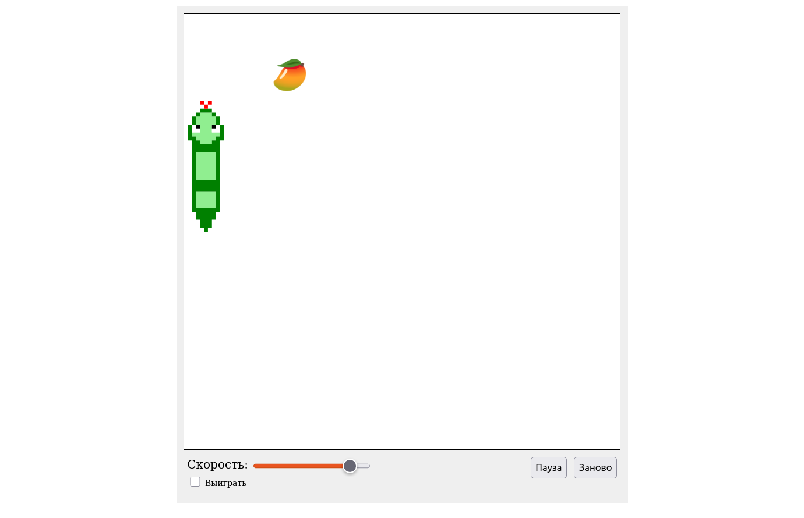

🌐 Language:  
🇬🇧 English | 🇷🇺 [Русский](README.ru.md)

# Snake Game

## 📌 What it is
A classic "Snake" game.
Controlled using keyboard arrow keys.

---

## 🖼 Screenshot

## 🔗 Demo
[▶ Open demo](https://5en5e.github.io/snake/)

---

## ⚙️ Features
- speed adjustment
- focus loss warning
- pause/start
- automatic win button (cheat mode)

---

## ⚠️ Known issues
- emoji food size depends on viewport height

---

## 🚧 Planned improvements
- fixing the issues mentioned above
- using semantic HTML tags
- replacing custom attributes with data-*
- adding gradual speed increase
- displaying snake length at game over
- ability to set grid size interactively
- separating DOM and game logic

---

## 🛠 Tech stack
- Vanilla JavaScript
- HTML
- CSS
